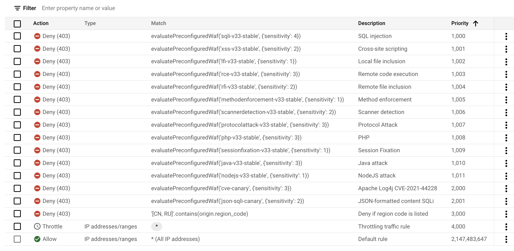

# cloud-armor
Terraform deployment for Cloud Armor

## Disclaimer
WARNING: This code is not meant to be used in a production environment! In which case, proceed with caution. But be warned, kitten deaths may occur.

Just don't say we didn't warn you. 

And remember, if anything goes wrong, you can always blame the kitten.


## Policy options
The policy is provided with default settings, how can be modified using the variables.tf file: 
- json_parsing = DISABLED
- log_level = VERBOSE

## Provisioned Rules
The rules are based on the owasp modsecurity CRS 3.3:
- Default rule
- OWASP Top 10
- Rate Limiting
- Cves and vulnerabilities (Log4J and Json-SQLi)
- Geo fencing

All rules (except the default one) are deployed in Preview mode (without impact on the workload), don't forget to remove the preview mode to block real traffic.

## Limitation
- The Global Load-balancer is not provisionned via this terraform. You need to take care of this part, manually, via Gcloud or via terraform
- If your endpoint if a JSON endpoint, be sure your enforce JSON-PARSING, otherwise, the WAF expression may not be able to get their jobs done properly

## Provision infrastructure
```
terraform init
terraform plan
terraform apply -auto-approve
```

