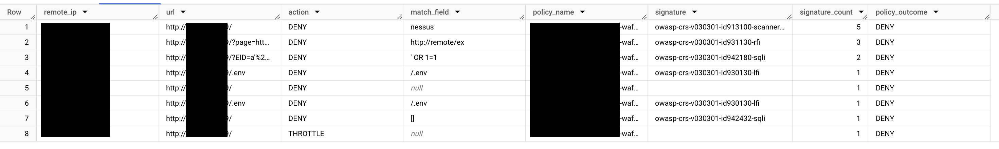

# cloud-armor
Terraform deployment for Cloud Armor Tunning

## Disclaimer
WARNING: This code is not meant to be used in a production environment! In which case, proceed with caution. But be warned, kitten deaths may occur.

Just don't say we didn't warn you. 

And remember, if anything goes wrong, you can always blame the kitten.


## Actions taken by terraform
```
- Creation of a service account to write logs into BigQuery
- Creation of dataset for cloud Armor log in BigQuery
- Creation of a log router with specific filter to capture Cloud armor logs
```

## Bigquery
After the deployment of this terraform, Cloud Armor logs will start flowing to Biquery. Here is an example how to list signature denied to help your application tunning
Don't forget to change the FROM clause to put your project Id.

```
SELECT
jsonpayload_type_loadbalancerlogentry.remoteip AS remote_ip,
httpRequest.requestUrl as url,
jsonpayload_type_loadbalancerlogentry.enforcedsecuritypolicy.configuredaction as action,
jsonpayload_type_loadbalancerlogentry.enforcedsecuritypolicy.matchedfieldvalue as match_field,
jsonpayload_type_loadbalancerlogentry.enforcedsecuritypolicy.name as policy_name,
ARRAY_TO_STRING(jsonpayload_type_loadbalancerlogentry.enforcedsecuritypolicy.preconfiguredexprids, ',') AS signature,
count(jsonpayload_type_loadbalancerlogentry.enforcedsecuritypolicy.preconfiguredexprids) as signature_count,
jsonpayload_type_loadbalancerlogentry.enforcedsecuritypolicy.outcome as policy_outcome

FROM `{your-project-id}.ClouldArmor.requests` 

WHERE jsonpayload_type_loadbalancerlogentry.enforcedsecuritypolicy.outcome = "DENY"

group by remote_ip, url,action,policy_name, signature, match_field, policy_outcome

ORDER by signature_count DESC
```

